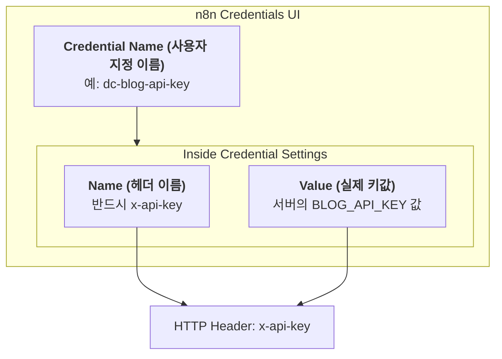

# Blog Auto Upload API

외부 서비스(n8n 등)에서 블로그 글을 자동으로 업로드하기 위한 API 문서입니다.

## Endpoint

```
POST https://distilledchild.space/api/tech-blog/auto
```

## Authentication

| Header | Value |
|--------|-------|
| `x-api-key` | `BLOG_API_KEY` 환경 변수 값 |
| `Content-Type` | `application/json` |

## n8n Credential vs Header (Confusion Guide)

n8n 설정 시 가장 헷갈리는 부분인 **Credential Name**과 **Header Name**의 차이입니다.



1. **Credential Name**: n8n 내부에서 노드를 설정할 때 리스트에 뜨는 이름입니다. (메모지 같은 역할)
2. **Key Name (Header Name)**: 실제로 서버가 전달받는 이름입니다. 반드시 **`x-api-key`** 여야 합니다.

## Request Body

```json
{
  "category": "Tech",          // Required: "Tech", "Biology", "Misc"
  "title": "글 제목",            // Required
  "content": "마크다운 내용...", // Required
  "author": {                   // Optional (기본값 제공)
    "name": "Pete",
    "email": "distilledchild@gmail.com",
    "avatar": "https://..."
  },
  "tags": ["n8n", "automation"], // Optional
  "references": [                // Optional: 참조 URL 목록
    "https://example.com/article1",
    "https://example.com/article2"
  ]
}
```

### Required Fields
- `category`: 블로그 카테고리 (Tech, Biology, Misc)
- `title`: 글 제목
- `content`: 마크다운 형식의 본문

### Optional Fields
- `author`: 기본값은 `distilledchild@gmail.com`
- `tags`: 문자열 배열
- `references`: 참조 URL 문자열 배열

## Response

### Success (201)
```json
{
  "success": true,
  "message": "Blog post created successfully",
  "post": {
    "_id": "...",
    "category": "Tech",
    "title": "글 제목",
    "content": "...",
    "isAutomated": true,
    "createdAt": "2025-01-22T...",
    ...
  }
}
```

### Errors
| Status | Error |
|--------|-------|
| 400 | Missing required fields |
| 401 | Invalid or missing API key |
| 500 | Internal server error |

## n8n Configuration

### HTTP Request Node 설정

1. **Method**: POST
2. **URL**: `https://distilledchild.space/api/tech-blog/auto`
3. **Authentication**: None (Header로 처리)
4. **Headers**:
   - `x-api-key`: `{{ $env.BLOG_API_KEY }}`
   - `Content-Type`: `application/json`
5. **Body**: JSON 형식으로 위 Request Body 참조

### 예시 Body (n8n Expression)
```json
{
  "category": "{{ $json.category }}",
  "title": "{{ $json.title }}",
  "content": "{{ $json.content }}",
  "tags": {{ $json.tags }}
}
```

## Environment Variables

### Local Development (.env)
```bash
BLOG_API_KEY=dc-blog-auto-2025-secure-key
```

### Cloud Run
Secret Manager에 `BLOG_API_KEY` 추가 필요:
```bash
gcloud secrets create BLOG_API_KEY --data-file=-
# 또는 Cloud Console에서 직접 추가
```

## Security Notes

- API Key는 외부에 노출되지 않도록 주의
- Production 환경에서는 더 강력한 키 사용 권장
- 모든 자동 업로드 글은 `isAutomated: true`로 표시됨
